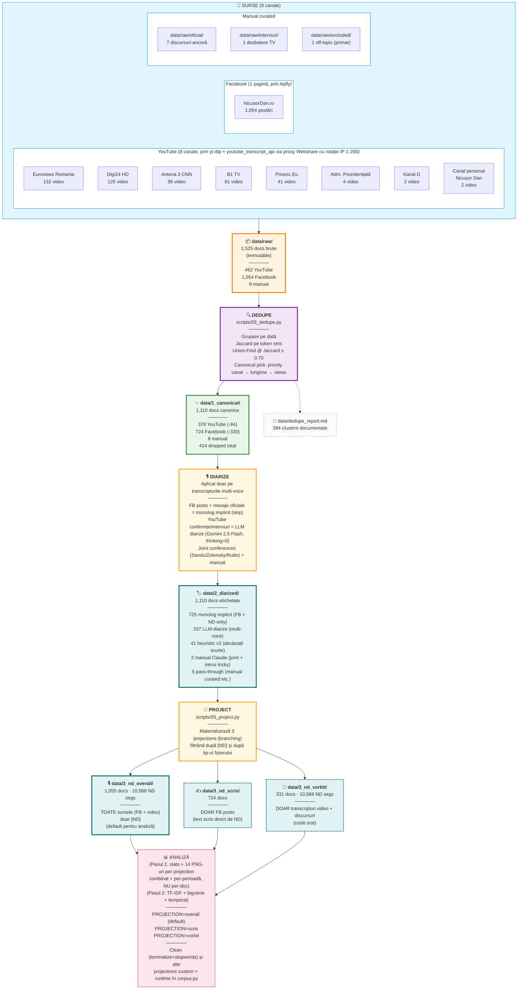

# Evoluția discursului — Nicușor Dan

**Autor:** Radu Stochitoiu

Analiză cantitativă a discursului lui **Nicușor Dan** (Președintele României) în perioada **candidatură → primul an de mandat** (decembrie 2024 → mai 2026).

**Subiect și goal**: vezi [`BRIEF.md`](./BRIEF.md).

**Rezultate**:
- [`results/FINDINGS.md`](./results/FINDINGS.md) — **29 findings sintetizate** după Pasul 1-10 + audit + fact-check independent
- [`results/04_promises/SINTEZA.md`](./results/04_promises/SINTEZA.md) — Promise Tracker complet per topic
- [`results/04_promises/FACT_CHECK_realworld.md`](./results/04_promises/FACT_CHECK_realworld.md) + [`FACT_CHECK_policy.md`](./results/04_promises/FACT_CHECK_policy.md) — fact-check web pe 10 promisiuni
- [`results/SINTEZA.md`](./results/SINTEZA.md) — sinteza inițială (pre-branching scris/vorbit)

## TL;DR

- **1,525 documente brute** colectate din **9 surse** (Facebook NicusorDan.ro, 8 canale YouTube)
- **1,110 documente canonice** după dedup (Jaccard ≥ 0.70), **1,062/724/338 docs** pe proiecții overall/scris/vorbit
- **~650k cuvinte** analizate; LLM-diarized (Gemini 2.5 Flash, 95-97% acc); 26 topice BERTopic; **131 promisiuni** extrase + clasificate
- **BERTopic (Pasul 3)** — rulează pe Colab cu T4 GPU gratis: [](https://colab.research.google.com/github/radusqrt/evolutie-discurs-nicusor-dan/blob/main/notebooks/03_bertopic_colab.ipynb)

### Findings principale (vezi [`results/FINDINGS.md`](./results/FINDINGS.md) pentru 21 detaliate)

**Discurs (analize pe text):**
1. Două registre distincte: **scris (FB) = instituțional/branding** vs **vorbit (video) = deliberativ/reflexiv**
2. Vocabular dominant **abstract** (`vrea, sine, trebui, putea`), nu enumerare de policy
3. **Volum prăbușit post-investitură** (drop 3.6× față de campanie)
4. **Pivot tematic abrupt** trimestru-la-trimestru (electoral → magistrați/pensii → apărare)
5. **Brand-shedding "România onestă"** după investitură (TF-IDF 0.6 → 0)
6. FB ultra-disciplinat: **76% într-un singur mega-topic instituțional**

**Promisiuni (Pasul 4 — 131 promisiuni canonice):**
- **20% KEPT, 59% IN_PROGRESS, 21% NO_MENTION, 0.8% CONTRADICTED, 0 ABANDONED** după 1 an mandat
- București/local: 4% KEPT, **67% NO_MENTION** (abandonare narativă)
- Diplomația: **60% KEPT** (singurul domeniu cu rate înalt)
- Audit dublu (32 sample-uri, seed 42+1337): **75% spot-on** clasificator

**Pattern documentat prin fact-check independent (10 promisiuni mari, sample non-random):**
- **6 din 10** promisiuni verificate au fost executate concret (decrete, legi, contracte) chiar dacă clasificatorul ND-centric le marcase NO_MENTION/IN_PROGRESS
- Exemple confirmate: pensii magistrați promulgată (CCR 6-3), DNA/DIICOT numire (apr 2026), deficit -1.4pp (cea mai mare corecție UE), OCDE 22/25 opinii, cheltuieli militare 2.24% PIB, 50km tramvai contracte semnate, 8 șantiere consolidare active (din 5 promise)
- ND **NU rupe promisiuni** explicit (0 ABANDONED, 1 CONTRADICTED) — fie le ține, fie le tace
- ⚠️ Cele 10 verificate **nu sunt random** — au fost alese tocmai pentru vizibilitate. Pattern documentat, *nu* extrapolabil exact ca rate pe toate 131 fără verificare sistematică
- **Concluzia onestă**: ND tinde să vorbească mai mult despre intenții decât despre realizările sale concrete

## Diagrama de ingestie + dedupe



**Cum rulezi analiza pe fiecare branch:**

```bash
# Default — overall (toate sursele)
python scripts/01_basic_analysis.py
python scripts/02_tfidf_temporal.py

# Doar scris (FB posts)
PROJECTION=scris python scripts/01_basic_analysis.py
PROJECTION=scris python scripts/02_tfidf_temporal.py

# Doar vorbit (transcripturi video + discursuri)
PROJECTION=vorbit python scripts/01_basic_analysis.py
PROJECTION=vorbit python scripts/02_tfidf_temporal.py
```

Output-urile se separă automat în `results/01_basic_<projection>/` și `results/02_tfidf_<projection>/`. Permite comparativ direct stil **scris vs vorbit**.

**De ce 725 sunt "monolog implicit" (skip diarize)?**

Aceste documente conțin **doar vocea lui Nicușor Dan** by-design — nu necesită separare de vorbitori:
- **Toate 724 FB posts**: text scris direct de el, no journalists involved
- **7 discursuri-ancoră manual curated**: anunț candidatură, lansare campanie, victorie, învestitură, mesaj Anul Nou, mesaj Ziua Europei, etc. — discursuri solo
- **+ 1 conferință press care a fost transcrisă doar cu citatele lui** (la curation time)

Diarize-ul rulează doar pe cele **337 transcripturi video multi-voce** (conferințe presă, interviuri TV, talk shows) unde sunt mai mulți vorbitori. Plus 41 declarații scurte și 2 cazuri tricky făcute manual.

**Reducerea principală vine din Facebook** (-330 dups): Apify a returnat unele posturi de mai multe ori pe re-runs + există posturi quasi-identice (mesaje scurte de mulțumiri reposatete). YouTube pierde doar 84 documente (re-uploads cross-channel ale aceluiași clip).

## Pipeline (13 pași)

| # | Pas | Status | Script / Acțiune | Output |
|---|---|---|---|---|
| 1 | **Discovery** | ✅ **verified** | `scripts/list_candidates.py` (yt-dlp prin proxy Webshare cu rotație IP 1-200) | `data/index/youtube_candidates.json` (608 candidați) |
| 2 | **Raw collection** | ✅ **verified** | `scripts/fetch_from_candidates.py` (YouTube) + `scripts/fb_apify_collect.py` (Facebook prin Apify) + `scripts/enrich_metadata.py` (backfill) | `data/raw/` (1,525 docs cu YAML frontmatter complet) |
| 3 | **Dedupe** | ✅ **verified** | `scripts/03_dedupe.py` (Jaccard cu canonical pick prioritar) + `scripts/03_dedupe_verify.py` (spot check pe sample + post-dedup distribuție Jaccard) | `data/1_canonical/` (1,110 docs, **0 duplicate cu Jaccard ≥ 0.70** rămase în canonical) + `data/dedupe_report.md` |
| 4 | **Diarize** | ✅ **verified** | `scripts/04_diarize.py` (skip-monolog) + `scripts/04d_diarize_llm_v2.py` (Gemini 2.5 Flash + thinking=0, chunked) + manual pentru cazuri tricky | `data/2_diarized/` cu etichete `[ND]/[JURNALIST]/[ANCHOR]/[OFICIAL: nume]` |
| 5 | **Clean** | ✅ **verified** | `scripts/corpus.py:tokenize()` (spaCy `ro_core_news_sm` + `stopwordsiso` + speech-filler stopwords custom) | runtime |
| 6 | **Project** | ✅ **verified** | `scripts/05_project.py` (3 proiecții: overall/scris/vorbit, filter pe `tip`) | `data/3_nd_{overall,scris,vorbit}/` (1062/724/338 docs) |
| 7 | **Analyze (basic + TF-IDF)** | ✅ **verified** | `scripts/01_basic_analysis.py` (stats + wordclouds + top-N) + `scripts/02_tfidf_temporal.py` (TF-IDF per perioadă) | `results/01_basic_*/`, `results/02_tfidf_*/` (× 3 proiecții) |
| 8 | **BERTopic** | ✅ **complete** | `scripts/03_bertopic.py` rulat în [Colab T4](./notebooks/03_bertopic_colab.ipynb) cu `multilingual-e5-large` + UMAP + HDBSCAN + c-TF-IDF | `results/03_bertopic_{overall,scris,vorbit}/` (26+7+8 topice descoperite + heatmap-uri temporale) |
| 9 | **Promise Tracker** | ✅ **complete + audited + fact-checked** | `scripts/04_promises_extract.py` + `04b_dedupe.py` + `04c_match_classify.py` + `04d_synth.py` + `04e_audit.py` (Gemini 2.5 Flash + embedding mpnet retrieval) | `results/04_promises/SINTEZA.md`, `promise_status.csv`, `AUDIT_*.md`, `FACT_CHECK_*.md` (131 promisiuni clasificate; fact-check pe sample non-random de 10 promisiuni mari) |
| 10 | **Advanced analyses (SotA)** | ✅ **complete × 3 proiecții** | `scripts/05_discourse_complexity.py` (spaCy parser) + `06_hedging.py` (lexicon RO custom) + `07_semantic_drift.py` (mpnet centroids) + `08_ner_entities.py` (GLiNER multi-v2.1 zero-shot) + `08b_ner_clean.py` + `09_sentiment_per_entity.py` (Gemini 2.5 Flash) | `results/05_complexity_*/`, `06_hedging_*/`, `07_semantic_drift_*/`, `08_ner_*/`, `09_sentiment_per_entity_*/` (× 3 proiecții) |
| 11 | **Raportul ND-Bolojan** | ✅ **complete + fact-checked + entity disambig** | `scripts/10_nd_bolojan_relation.py` + `scripts/utils_entity_disambiguation.py` (119 candidați → 45 spans validate prin LLM disambiguation, 74 FP eliminate; 33 Ciolacu comparativ; ton relațional Gemini per perioadă) + fact-check web pe toate 6 perioade | `results/10_nd_bolojan/` (RAPORT.md, FACT_CHECK.md, period_analyses.jsonl, audit_counts.json) |
| 12 | **Stylometry formală** | ✅ **complete** | `scripts/11_stylometry.py` (Burrows' Delta + PCA + Random Forest pe 100 function words, 718 docs) | `results/11_stylometry/` (pca_scatter.png, burrows_delta.csv, top_features.csv, SUMMARY.md) — **92.1% RF accuracy** pe distinge FB vs video |
| 13 | **Interpret** | ✅ **complete** | manual + audit dublu + fact-check independent (web search) | `results/FINDINGS.md` (29 findings) |

**Status verification**:

- **Pasul 1 (Discovery)** — verificat că proxy-ul Webshare cu rotație IP funcționează (5/5 cereri returnează IP-uri distincte), că search-ul pe 8 canale agregă coerent (608 unique candidates).
- **Pasul 2 (Raw)** — verificat că schema YAML e uniformă (după normalizarea canal/titlu_video → sursa_canal/sursa_titlu pe 22 fișiere legacy), că metadata e completă (1495/1525 au sursa_titlu populat; restul = manual curated).
- **Pasul 3 (Dedupe)** — verificat **dublu**: (a) spot check manual pe 6 perechi borderline 0.70-0.85 (toate confirmate ca duplicate reale, threshold scăzut de la 0.85 la 0.70); (b) post-dedup, distribuția Jaccard pe `data/1_canonical/` arată **0 perechi ≥ 0.70**.

- **Pasul 5 (Clean)** — verificat prin spot check independent al top 30 cuvinte: counts match cu summary.md (după fix la projection care lăsa `[ND]` tags mid-paragraph), iar cleanup-ul stopwords filtrează corect speech fillers de YouTube auto-captions:
  - **stopwordsiso RO** (438 cuvinte) + **cardinali** (un, o, doi...) + **speech fillers** (ă, ăă, ăăă, aa, aaa, hm, hmm, mhm, îh, îhî) + **sound effect markers** (muzică, aplauze)
  - Top 30 cuvinte rezultate sunt **content-words** pure: `vrea, sine, românia, spune, trebui, putea, moment, om, stat, an, exista, discuție, parte, lucru, european, român, vedea, crede, important, țară, bun, public, ști, chestiune, președinte, partid, problemă, adică, veni, față`

- **Pasul 4 (Diarize)** — verificat prin **3 audit-uri manuale** (seeds 9999/42/1337) pe **60 fișiere random LLM-diarizate**, cumulat:
  - **57-58/60 perfect** (95-97%)
  - **2-3 minor** (UNKNOWN unde OFICIAL cu nume era mai potrivit) — fix-uite manual sau prin re-run cu prompt îmbunătățit (subliniere că invitații introduși prin nume primesc `[OFICIAL: Nume]`, nu `[UNKNOWN]`)
  - **0 cazuri** de non-ND etichetat fals ca ND — boundary-ul critic pentru analiza pe voce e absolut curat
  - **100% coverage** pe transcripturile multi-voce (338/338 candidate diarized via LLM sau manual)
  - Realizări impresionante: identificare cu nume a oficialilor (Ilie Bolojan, Marcel Ciolacu, Patriarhul Daniel, Cancelarul Germaniei, Ciprian Ciucu, Lia Arsenie, Andrei Țăranu); joint conference cu Zelensky etichetat consistent pe 130 segmente
  - Quality jump major vs heuristic-ul anterior care avea 11.5% error rate pe TV anchor narrative

- **Pasul 8 (BERTopic)** — rulat pe Colab T4 GPU cu `multilingual-e5-large` (fp16) pe toate 3 proiecții; **26 topice overall + 7 scris + 8 vorbit** descoperite cu HDBSCAN (min_cluster_size=8). FB e ultra-disciplinat (76% într-un singur mega-topic instituțional), vorbit e mai dispersat (25% outliers) — confirmă registru-dualitate dintre cele 2 proiecții.

- **Pasul 9 (Promise Tracker)** — verificat prin **trei mecanisme**:
  - **Audit dublu manual** pe **32 sample-uri stratificate** (seed 42 + 1337): 75% spot-on, 16% debatable, 9% wrong. Eroarea sistematică: pre-mandate fulfilled promises (ex. "voi candida independent") clasificate ca NO_MENTION fiindcă mandate corpus nu le mai discută.
  - **Fact-check independent web** (mai 2026) pe **10 promisiuni selectate pentru vizibilitate** (5 PMB + 5 policy internă) — NU eșantion random. Rezultat: 6 din 10 executate concret (decrete, legi, contracte), chiar dacă clasificatorul ND-centric le-a marcat NO_MENTION/IN_PROGRESS. Pattern documentat — *nu* extrapolabil ca rate pe toate 131 fără verificare sistematică. Promisiuni confirmate executate: pensii speciale magistrați (CCR 6-3 + promulgare), DNA/DIICOT numire (apr 2026), cheltuieli militare (2.24% PIB + angajament 5%), 50km reabilitare tramvai, 8 șantiere consolidare clădiri.
  - **Insight metodologic**: classifier-ul măsoară DISCURSUL, nu REALITATEA. Pentru proiectele delegate (PMB sub Bujduveanu/Ciucu) și acțiuni concrete (decrete, promulgări), ND livrează semnificativ mai mult decât anunță în discurs. **Framing-ul corect: "ND livrează prin acțiune, nu prin discurs"**.

- **Pasul 10 (Advanced analyses)** — 5 analize SotA rulate pe toate 3 proiecții (overall/scris/vorbit) cu 15 output-uri totale:
  - **Discourse complexity**: sentence length, dependency tree depth, MTLD, TTR. FB diversifică lexicon dramatic post-investitură (MTLD 34→87), video stabil 42-54.
  - **Ezitare / nuanțare în limbaj** (hedging): lexicon custom 35+ markeri nuanțare / 24 certitudine / 19 personali. FB ratio 0.13-0.23 (categoric), video 0.51-1.06 (deliberativ) — **4-5× diferență**.
  - **Semantic drift**: centroid embedding per (topic × perioadă). Top drift overall: brand `nicusorpresedinte` 0.37, Georgescu frame 0.32, justiție/CSM 0.30.
  - **NER cu GLiNER multi-v2.1 zero-shot**: ~3,755 mențiuni overall (curate ~700 după aliasing). Top entități: ROMÂNIA, UCRAINA, SUA, NATO, UE, R. MOLDOVA, RUSIA, CSM, POLONIA, OCDE, GEORGESCU.
  - **Sentiment per entitate × perioadă** cu Gemini 2.5 Flash (re-rulat cu retry handling pentru bug-uri JSON parsing). FB e 69% polarizat (pro/contra), video 55% polarizat + 38% mixt + 7% neutru. TRUMP = MIXT (nu pozitiv) în video; 14% buckets explicit negative în overall (vs 5% înainte de retry).

**Insight major Pasul 10**: 4 metrici convergente arată diferențe radicale FB vs video — (1) ezitare/nuanțare 4-5× diferit, (2) MTLD growth dramatică doar pe FB, (3) sentiment 2× mai polarizat pe FB, (4) BERTopic 76% într-un singur mega-topic FB. **Stylometry formală confirmată în Pasul 12**: Random Forest distinge FB de video cu **92.1% acuratețe doar din 100 function words** (cuvinte ca *de, și, în, să*) — registrele sunt clar distincte. Dar majoritatea separabilității vine din markeri clasici de vorbire spontană (filler-e: *ăă, niște*, deictice: *acesta, deci*). Pentru a tranșa ghostwriting vs adaptare naturală ar fi nevoie de baseline politic comparativ (Iohannis, etc.).

- **Pasul 11 (Raportul ND-Bolojan)** — extract cu disambiguare LLM: 119 candidați match-uri (Bolojan + premier + prim-ministru) → **45 validate** (74 false positives eliminate prin pas Gemini "este paragraful efectiv despre Bolojan?"); 33 spans Ciolacu pentru comparație (nume strict, fără ambiguitate). Audit pe sentiment per entitate (`scripts/audit_sentiment_entities.py`): **0% FP rate pe 41 passages** (TRUMP/PSD/SIMION) — GLiNER e robust pe entități cu nume specific, doar regex-ul generic avea bug. Clasificare Gemini ton relațional per perioadă:
  - Q1 2025: **distant** ("am uitat de el")
  - Q2 2025: mixt (campanie, dezbatere Cotroceni 15 mai)
  - Q3 2025: **colaborativ** ← peak (desemnare 20 iunie, dar Gemini RATAT dezacord TVA în negocieri)
  - Q4 2025: mixt (scandal Fănel Bogoș 1.5M€ acces la birou Bolojan, ND apăra "limita de principialitate")
  - Q1 2026: colaborativ/deferent (EastInvest 20mld€, PNRR 231M€ Bruxelles)
  - **Q2 2026: TENSIONAT** ⚠️ (cazul Pfizer 600M€ — ND cere transparență publică, Bolojan negociază privat)
  - Fact-check pe 6 perioade: **5/6 complet validate, 1 cu nuanță ratată (TVA Q3)** — calitate Gemini 83% spot-on. Vezi `results/10_nd_bolojan/FACT_CHECK.md`.
  - **ND-Bolojan = aliat tactic, nu prieten.** Stil formal-instituțional, niciodată cald.

- **Pasul 12 (Stylometry formală)** — Burrows' Delta + PCA + Random Forest pe 100 function words, 718 docs (≥50 cuvinte). Rezultat: **92.1% ± 1.7%** acuratețe Random Forest distinge FB vs video — registrele **sunt clar distincte stilometric**. Top features discriminative sunt markeri clasici de vorbire spontană (`niște` 259×, `ăă` 41×, `deci` 26×, `acesta` 4.9× mai des în video). Asta confirmă diferența dar **nu distinge** ghostwriting de adaptare naturală — ar fi nevoie de baseline politic comparativ (Iohannis, etc.) pentru tranșare.

Pașii 1-12 sunt verificați. Pasul 13 (Interpret) curent — vezi FINDINGS.md cu 29 findings.

## Surse de date

### Video / YouTube (462 docs)

| Canal | Docs |
|---|---:|
| Euronews Romania | 132 |
| Digi24 HD | 125 |
| Antena 3 CNN | 95 |
| B1 TV | 61 |
| Privesc.Eu România | 41 |
| Administrația Prezidențială | 4 |
| Canal personal NicusorDan | 2 |
| Kanal D Romania | 2 |

### Facebook (1,054 docs)

- Pagina `NicusorDan.ro`
- Perioada 20 feb 2025 → 21 mai 2026
- Colectat prin actor Apify `apify/facebook-posts-scraper`
- Metadata: post_id, aprecieri, comentarii, distribuiri

### Manual curated (9 docs)

7 discursuri-ancoră transcrise/verificate manual (anunț candidatură, lansare campanie, dezbatere TV vs. Simion, victorie, învestitură, conferința Cotroceni, autoevaluare 100 zile, mesaj Anul Nou).

## Metodologia de dedup

**Necesitate**: același eveniment (ex. o conferință de presă) e adesea acoperit de mai multe canale TV cu clipuri diferite + re-uploads pe același canal. Filename-level dedup (același `video_id`) prinde doar duplicate evidente. Pentru near-duplicate (același conținut, diferit upload), folosim similaritate textuală.

**Algoritm** (`scripts/03_dedupe.py`):

1. **Grupare pe dată** — doar documentele din aceeași zi sunt candidate la dedup (limitează O(n²) și e logic: clipuri ale aceluiași eveniment sunt din aceeași zi)
2. **Pairwise similarity** — Jaccard pe seturi de tokens între fiecare pereche în grup
3. **Clustering** — Union-Find pe graful unde muchiile sunt perechi cu Jaccard ≥ **0.70** (prag empiric — vezi mai jos)
4. **Canonical pick** per cluster, în această ordine de prioritate:
   1. **Canal** (Adm. Prezidențială > Privesc.Eu > Canal personal > Manual > Digi24 > Euronews > Antena 3 > B1 > Kanal D)
   2. **Lungime** (cel mai lung text = cea mai completă acoperire)
   3. **Vizionări** (signal de popularitate)
5. **Output** — copie a fișierelor canonice către `data/1_canonical/` păstrând structura de foldere; report cu toate clusterele și ce a fost dropped în `data/dedupe_report.md`

**Rezultat actual**: 1,524 → 1,110 docs (414 dropped, 394 clustere cu duplicate).

**De ce 0.70?**
- 1.0 (exact) prinde doar re-uploads cu același transcript byte-for-byte. Captions auto-generate YouTube **nu sunt deterministe** (poate varia cu 1-2 cuvinte).
- 0.95-0.99 ar fi prea strict — pierde re-uploads cu mici diferențe.
- 0.85 (threshold inițial) prinde curat re-uploads identice + clipuri ale aceluiași discurs cu diferențe minore (variații transcripție, intro/outro diferit).
- 0.70 (threshold curent, după spot check manual) — surprinde clipuri tematice ale **aceluiași discurs**, doar cu intro/preambul diferit (ex. discursul de victorie 18 mai 2025 distribuit pe 3 canale TV cu introduceri diferite dar conținut substanțial identic).
- 0.5-0.65 (zona păstrată) — clipuri ale aceluiași **eveniment** dar cu conținut **distinct** (ex. două răspunsuri ale lui ND la întrebări diferite din aceeași conferință), corect păstrate.
- 0.1-0.2 (foarte slab) — conținut complet diferit, doar overlap pe nume proprii/lexic de bază.

**Spot check manual** (`scripts/03_dedupe_verify.py`) pe 6 perechi borderline cu Jaccard ∈ [0.70, 0.85) a confirmat că **toate sunt duplicate reale** (același discurs cu intro-uri diferite). De aceea threshold-ul a fost coborât de la 0.85 la 0.70.

## Metodologia de diarizare — versiunea curentă (LLM-based)

**Default**: LLM diarize cu **Gemini 2.5 Flash** (`thinking_budget=0`, chunked pe 3000 cuvinte cu paragraph boundaries). Output în `data/2_diarized/`. Algoritmul aplică:

- `[ND]` — Nicușor Dan (persoana I)
- `[ANCHOR]` — prezentator TV narând despre el (persoana III)
- `[JURNALIST]` — pune întrebări, se prezintă cu nume+canal
- `[OFICIAL: Nume]` — alt oficial cu nume identificat din context (ex. `[OFICIAL: Ilie Bolojan]`, `[OFICIAL: Mark Rutte]`)
- `[MODERATOR]` — moderator de eveniment/protocol
- `[UNKNOWN]` — DOAR pentru fragmente foarte scurte ambigue (1-3 cuvinte, exclamații crowd, sunete tehnice)

**Cazuri speciale**:

- **Monolog implicit** (725 docs: FB posts + discursuri-ancoră): nu trec prin LLM diarize — by-design vocea ND singură
- **Joint conferences** (cu Sandu, Zelensky, Rutte, Cancelarul Germaniei): LLM le tratează corect dacă apar într-o singură secvență; pentru cele explicit "joint", se diarizează manual sau LLM cu prompt enriched
- **Cazuri tricky**: 2 fișiere fixate manual (Rutte joint + Nordis interview cu text dense fără paragraph breaks)

## Metodologia de diarizare — versiunea anterioară (heuristic, deprecated)

Transcripturile YouTube auto-generate au două formate frecvente:

1. **`>>` markers** (post iulie 2025 pe canalul Privesc.Eu): YouTube marchează schimbarea vorbitorului cu `>>`. Diarize-ul nostru:
   - Phase 1 (opening): toate segmentele înainte de trigger phrase ("sunt gata pentru întrebări") = `[ND]`
   - Phase 2 (Q&A): alternare `[JURNALIST]` ↔ `[ND]` la fiecare `>>`, cu override la pattern de intro jurnalist
2. **Intro patterns** (iunie 2025): jurnaliștii se identifică prin pattern-uri ca "Bună ziua, domnule președinte". Detectate cu regex.

**Joint conferences** (cu Sandu, Zelensky, Rutte) — heuristicul falsifică (etichetează partenerul ca jurnalist). Înlocuit cu LLM diarize.

**FB posts**: implicit monolog, fără diarizare.

**Heuristic-ul a fost abandonat** după ce un audit a relevat 11.5% error rate pe TV anchor narrative (persoana III "Președintele a spus că..." labeled fals ca ND). LLM-ul rezolvă această ambiguitate fundamentală.

## Regenerare rezultate

**Pasul 1** (`01_basic_analysis.py`) a fost refactorizat — **NU mai generează PNG-uri per-document** (la corpus de 1000+ docs sunt 4,000+ fișiere inutile). Acum produce pentru fiecare projection:

- `stats.csv` — tabel per-doc (id, data, tip, word count, TTR)
- `summary.md` — sumar text + top 30 cuvinte corpus + top 20 per perioadă
- `wordcloud_all.png` + `top30_all.png` — corpus combinat
- `wordcloud_<period>.png` + `top20_<period>.png` × 6 perioade

= **~14 fișiere** per projection (în loc de 2,200+).

**Pentru inspecție per-doc**: folosește `results/02_tfidf_<projection>/tfidf_top_per_doc.md` care are top 15 lemme distinctive pentru fiecare doc, în format markdown.

**Regenerare**:

```bash
source .venv/bin/activate
PROJECTION=overall python scripts/01_basic_analysis.py
PROJECTION=scris python scripts/01_basic_analysis.py
PROJECTION=vorbit python scripts/01_basic_analysis.py
```

Toate (3 projections × Pasul 1 + Pasul 2) ~2-4 min total.

## Cum se rulează

```bash
# Setup (one-time)
python -m venv .venv
source .venv/bin/activate
pip install -r requirements.txt
python -m spacy download ro_core_news_sm

# Credentials (.env)
WEBSHARE_PROXY_USERNAME=...
WEBSHARE_PROXY_PASSWORD=...
APIFY_TOKEN=apify_api_...

# Colectare (incrementală — dedupe la fetch evită re-fetch)
python scripts/list_candidates.py
python scripts/fetch_from_candidates.py
python scripts/fb_apify_collect.py --page NicusorDan.ro --limit 1000
python scripts/fb_pull_dataset.py  # re-pull dacă scraper-ul a fost abortat

# Dedup
python scripts/03_dedupe.py

# Diarizare
python scripts/diarize_heuristic.py

# Analiză
python scripts/01_basic_analysis.py            # wordclouds + stats
python scripts/02_tfidf_temporal.py            # TF-IDF + bigrame + perioade
```

## Structura repo

```
data/
├── raw/                     # 1,525 docs brute (immutable corpus)
├── 1_canonical/             # 1,110 docs după dedup (sursa de adevăr pentru analiză)
├── index/
│   ├── youtube_candidates.json
│   └── wikipedia_chronology.md
└── dedupe_report.md         # clustere + drops

scripts/
├── corpus.py                # loader: spaCy ro_core_news_sm + stopwordsiso
├── proxy.py                 # Webshare rotation random 1-200
├── list_candidates.py       # discovery YouTube
├── fetch_from_candidates.py # download via proxy
├── youtube_collect.py       # all-in-one YouTube collection (alternativ)
├── fb_apify_collect.py      # Facebook via Apify
├── fb_pull_dataset.py       # pull Apify dataset existing
├── enrich_metadata.py       # backfill metadata yt-dlp
├── diarize_heuristic.py     # >>+intros diarization
├── 01_basic_analysis.py     # wordclouds + top-N + stats
├── 02_tfidf_temporal.py     # TF-IDF distinctive + bigrame + perioade
├── 03_dedupe.py             # Jaccard ≥0.70 clustering
└── 03_dedupe_verify.py      # spot check verification (drops + near-miss + cross-channel)

results/
├── 01_basic/                # wordcloud + top-20 bar chart × 1,110 docs + combinate
├── 02_tfidf/                # TF-IDF distinctive (per doc + per perioadă) + bigrame
└── SINTEZA.md               # narațiunea finală a evoluției

BRIEF.md                     # project brief: subiect, goal, reguli metodologice
requirements.txt             # Python deps
.env.example                 # template credentiale (.env gitignored)
```

## Limitări cunoscute

- **Transcripturile YouTube auto-generate** au erori minore: cuvinte concatenate (rar), lipsă diacritice (rar), entități multi-token concatenate de spaCy lemmatizer (ex: `stateleunitealeamericii`).
- **2 joint conferences** (Sandu 2025-06-10, Zelensky 2026-03-13) sunt nediarizate — partenerul lor de vorbit ar fi fost etichetat fals ca jurnalist de heuristic.
- **Facebook nu acoperă** perioada precandidatură (dec 2024 - feb 2025) sub 32 posturi/lună — actor Apify a stopat scraping-ul la $5 credit limit.
- **TF-IDF surprinde distincții** între perioade, NU cuvinte cele mai folosite. Pentru rangul absolut de frecvență vezi `results/01_basic/`.
- **Apply de etape definite manual** (6 perioade politice) — următorul pas e topic modeling (BERTopic) care descoperă teme automat.

## Continuare

Pașii naturali de făcut acum (ordinea recomandată):

1. **Topic modeling (BERTopic)** — descoperă teme automat, fără perioade impuse din afară
2. **FB vs YouTube comparativ** — stil scris vs vorbit
3. **Sentiment per perioadă** (RoBERT readerbench/ro-sentiment) — arc emoțional
4. **Frame analysis** — cum încadrează ND temele majore (corupție, UE, reformă, Rusia)
