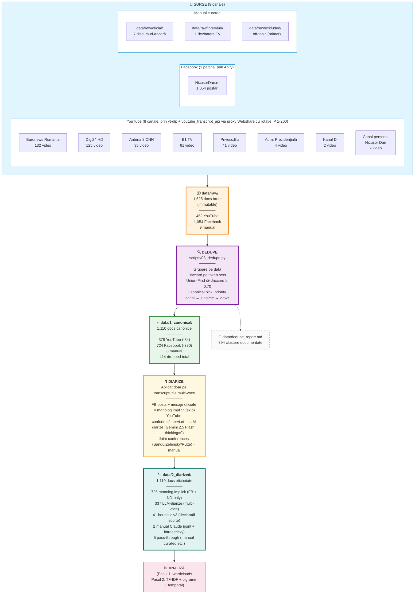

# Evoluția discursului — Nicușor Dan

**Autor:** Radu Stochitoiu

Analiză cantitativă a discursului lui **Nicușor Dan** (Președintele României) în perioada **candidatură → primul an de mandat** (decembrie 2024 → mai 2026).

**Subiect și goal**: vezi [`BRIEF.md`](./BRIEF.md). Rezultate sintetice: [`results/SINTEZA.md`](./results/SINTEZA.md).

## TL;DR

- **1,525 documente brute** colectate din **9 surse** (Facebook NicusorDan.ro, 8 canale YouTube)
- **1,110 documente canonice** după dedup (Jaccard ≥ 0.70)
- **~650k cuvinte** analizate
- **6 etape de discurs** detectate cu TF-IDF pe perioade
- Arc narativ: *diagnostic critic → mobilizare electorală → tehnocrat → comandant suprem → reformator instituțional → leader regional*

## Diagrama de ingestie + dedupe



**De ce 725 sunt "monolog implicit" (skip diarize)?**

Aceste documente conțin **doar vocea lui Nicușor Dan** by-design — nu necesită separare de vorbitori:
- **Toate 724 FB posts**: text scris direct de el, no journalists involved
- **7 discursuri-ancoră manual curated**: anunț candidatură, lansare campanie, victorie, învestitură, mesaj Anul Nou, mesaj Ziua Europei, etc. — discursuri solo
- **+ 1 conferință press care a fost transcrisă doar cu citatele lui** (la curation time)

Diarize-ul rulează doar pe cele **337 transcripturi video multi-voce** (conferințe presă, interviuri TV, talk shows) unde sunt mai mulți vorbitori. Plus 41 declarații scurte și 2 cazuri tricky făcute manual.

**Reducerea principală vine din Facebook** (-330 dups): Apify a returnat unele posturi de mai multe ori pe re-runs + există posturi quasi-identice (mesaje scurte de mulțumiri reposatete). YouTube pierde doar 84 documente (re-uploads cross-channel ale aceluiași clip).

## Pipeline (8 pași)

| # | Pas | Status | Script / Acțiune | Output |
|---|---|---|---|---|
| 1 | **Discovery** | ✅ **verified** | `scripts/list_candidates.py` (yt-dlp prin proxy Webshare cu rotație IP 1-200) | `data/index/youtube_candidates.json` (608 candidați) |
| 2 | **Raw collection** | ✅ **verified** | `scripts/fetch_from_candidates.py` (YouTube) + `scripts/fb_apify_collect.py` (Facebook prin Apify) + `scripts/enrich_metadata.py` (backfill) | `data/raw/` (1,525 docs cu YAML frontmatter complet) |
| 3 | **Dedupe** | ✅ **verified** | `scripts/03_dedupe.py` (Jaccard cu canonical pick prioritar) + `scripts/03_dedupe_verify.py` (spot check pe sample + post-dedup distribuție Jaccard) | `data/1_canonical/` (1,110 docs, **0 duplicate cu Jaccard ≥ 0.70** rămase în canonical) + `data/dedupe_report.md` |
| 4 | **Diarize** | ✅ **verified** | `scripts/04_diarize.py` (skip-monolog) + `scripts/04d_diarize_llm_v2.py` (Gemini 2.5 Flash + thinking=0, chunked) + manual pentru cazuri tricky | `data/2_diarized/` cu etichete `[ND]/[JURNALIST]/[ANCHOR]/[OFICIAL: nume]` |
| 5 | **Clean** | ⏳ funcțional | `scripts/corpus.py:tokenize()` (spaCy `ro_core_news_sm` + `stopwordsiso`) | runtime |
| 6 | **Project** | ⏳ funcțional | `scripts/corpus.py:strip_speaker_tags_to_nd()` (filtrare voce ND) | runtime |
| 7 | **Analyze** | ⏳ funcțional | `scripts/01_basic_analysis.py` (stats + wordclouds + top-N) + `scripts/02_tfidf_temporal.py` (TF-IDF + bigrame + perioade) | `results/01_basic/`, `results/02_tfidf/` |
| 8 | **Interpret** | ⏳ în curs | manual | `results/SINTEZA.md` |

**Status verification**:

- **Pasul 1 (Discovery)** — verificat că proxy-ul Webshare cu rotație IP funcționează (5/5 cereri returnează IP-uri distincte), că search-ul pe 8 canale agregă coerent (608 unique candidates).
- **Pasul 2 (Raw)** — verificat că schema YAML e uniformă (după normalizarea canal/titlu_video → sursa_canal/sursa_titlu pe 22 fișiere legacy), că metadata e completă (1495/1525 au sursa_titlu populat; restul = manual curated).
- **Pasul 3 (Dedupe)** — verificat **dublu**: (a) spot check manual pe 6 perechi borderline 0.70-0.85 (toate confirmate ca duplicate reale, threshold scăzut de la 0.85 la 0.70); (b) post-dedup, distribuția Jaccard pe `data/1_canonical/` arată **0 perechi ≥ 0.70**.

- **Pasul 4 (Diarize)** — verificat prin **2 audit-uri manuale** pe 20+20 fișiere random LLM-diarizate: ~88-90% segmente perfect etichetate, ~3-7% erori minore (ANCHOR vs JURNALIST blur, fragmente UNKNOWN). 0 candidate left undiarized — 100% coverage pe transcripturile multi-voce. Quality jump major vs heuristic-ul anterior care avea 11.5% error rate pe TV anchor narrative.

Pașii 5-8 sunt funcționali, dar nu au trecut printr-un check formal de validitate.

## Surse de date

### Video / YouTube (462 docs)

| Canal | Docs |
|---|---:|
| Euronews Romania | 132 |
| Digi24 HD | 125 |
| Antena 3 CNN | 95 |
| B1 TV | 61 |
| Privesc.Eu România | 41 |
| Administrația Prezidențială | 4 |
| Canal personal NicusorDan | 2 |
| Kanal D Romania | 2 |

### Facebook (1,054 docs)

- Pagina `NicusorDan.ro`
- Perioada 20 feb 2025 → 21 mai 2026
- Colectat prin actor Apify `apify/facebook-posts-scraper`
- Metadata: post_id, aprecieri, comentarii, distribuiri

### Manual curated (9 docs)

7 discursuri-ancoră transcrise/verificate manual (anunț candidatură, lansare campanie, dezbatere TV vs. Simion, victorie, învestitură, conferința Cotroceni, autoevaluare 100 zile, mesaj Anul Nou).

## Metodologia de dedup

**Necesitate**: același eveniment (ex. o conferință de presă) e adesea acoperit de mai multe canale TV cu clipuri diferite + re-uploads pe același canal. Filename-level dedup (același `video_id`) prinde doar duplicate evidente. Pentru near-duplicate (același conținut, diferit upload), folosim similaritate textuală.

**Algoritm** (`scripts/03_dedupe.py`):

1. **Grupare pe dată** — doar documentele din aceeași zi sunt candidate la dedup (limitează O(n²) și e logic: clipuri ale aceluiași eveniment sunt din aceeași zi)
2. **Pairwise similarity** — Jaccard pe seturi de tokens între fiecare pereche în grup
3. **Clustering** — Union-Find pe graful unde muchiile sunt perechi cu Jaccard ≥ **0.70** (prag empiric — vezi mai jos)
4. **Canonical pick** per cluster, în această ordine de prioritate:
   1. **Canal** (Adm. Prezidențială > Privesc.Eu > Canal personal > Manual > Digi24 > Euronews > Antena 3 > B1 > Kanal D)
   2. **Lungime** (cel mai lung text = cea mai completă acoperire)
   3. **Vizionări** (signal de popularitate)
5. **Output** — copie a fișierelor canonice către `data/1_canonical/` păstrând structura de foldere; report cu toate clusterele și ce a fost dropped în `data/dedupe_report.md`

**Rezultat actual**: 1,524 → 1,110 docs (414 dropped, 394 clustere cu duplicate).

**De ce 0.70?**
- 1.0 (exact) prinde doar re-uploads cu același transcript byte-for-byte. Captions auto-generate YouTube **nu sunt deterministe** (poate varia cu 1-2 cuvinte).
- 0.95-0.99 ar fi prea strict — pierde re-uploads cu mici diferențe.
- 0.85 (threshold inițial) prinde curat re-uploads identice + clipuri ale aceluiași discurs cu diferențe minore (variații transcripție, intro/outro diferit).
- 0.70 (threshold curent, după spot check manual) — surprinde clipuri tematice ale **aceluiași discurs**, doar cu intro/preambul diferit (ex. discursul de victorie 18 mai 2025 distribuit pe 3 canale TV cu introduceri diferite dar conținut substanțial identic).
- 0.5-0.65 (zona păstrată) — clipuri ale aceluiași **eveniment** dar cu conținut **distinct** (ex. două răspunsuri ale lui ND la întrebări diferite din aceeași conferință), corect păstrate.
- 0.1-0.2 (foarte slab) — conținut complet diferit, doar overlap pe nume proprii/lexic de bază.

**Spot check manual** (`scripts/03_dedupe_verify.py`) pe 6 perechi borderline cu Jaccard ∈ [0.70, 0.85) a confirmat că **toate sunt duplicate reale** (același discurs cu intro-uri diferite). De aceea threshold-ul a fost coborât de la 0.85 la 0.70.

## Metodologia de diarizare

Transcripturile YouTube auto-generate au două formate frecvente:

1. **`>>` markers** (post iulie 2025 pe canalul Privesc.Eu): YouTube marchează schimbarea vorbitorului cu `>>`. Diarize-ul nostru:
   - Phase 1 (opening): toate segmentele înainte de trigger phrase ("sunt gata pentru întrebări") = `[ND]`
   - Phase 2 (Q&A): alternare `[JURNALIST]` ↔ `[ND]` la fiecare `>>`, cu override la pattern de intro jurnalist
2. **Intro patterns** (iunie 2025): jurnaliștii se identifică prin pattern-uri ca "Bună ziua, domnule președinte". Detectate cu regex.

**Joint conferences** (cu Sandu, Zelensky, Rutte) — heuristicul falsifică (etichetează partenerul ca jurnalist). Pentru ele: diarizare manuală (1 fișier completat — Rutte; 2 rămase nediarizate).

**FB posts**: implicit monolog, fără diarizare.

## Regenerare rezultate (wordcloud-uri per document)

Repo-ul **NU urcă pe Git** wordcloud-urile și bar chart-urile per-document (sunt 2,200+ fișiere PNG ~ 510 MB, regenerabile). Sunt git-ignorate prin pattern-ul:

```
results/01_basic/wordcloud_2*.png
results/01_basic/top20_2*.png
```

**Pe Git rămân** (lightweight, valoros):

- `results/01_basic/summary.md` (top words per doc + corpus, tabelar)
- `results/01_basic/stats.csv` (word counts + TTR per doc)
- `results/01_basic/wordcloud_all.png` (wordcloud combinat pentru tot corpus-ul)
- `results/01_basic/top20_all.png` (top 30 cuvinte din corpus-ul integral)
- `results/02_tfidf/*` (TF-IDF complete + bigrame + perioade)
- `results/SINTEZA.md` (narațiunea finală)

**Pentru regenerare locală** (după ce clonezi repo-ul):

```bash
source .venv/bin/activate
python scripts/01_basic_analysis.py
```

Asta produce **toate 2,200+ fișiere** PNG (~3-5 min CPU pentru 1,110 documente cu spaCy). Output în `results/01_basic/`.

## Cum se rulează

```bash
# Setup (one-time)
python -m venv .venv
source .venv/bin/activate
pip install -r requirements.txt
python -m spacy download ro_core_news_sm

# Credentials (.env)
WEBSHARE_PROXY_USERNAME=...
WEBSHARE_PROXY_PASSWORD=...
APIFY_TOKEN=apify_api_...

# Colectare (incrementală — dedupe la fetch evită re-fetch)
python scripts/list_candidates.py
python scripts/fetch_from_candidates.py
python scripts/fb_apify_collect.py --page NicusorDan.ro --limit 1000
python scripts/fb_pull_dataset.py  # re-pull dacă scraper-ul a fost abortat

# Dedup
python scripts/03_dedupe.py

# Diarizare
python scripts/diarize_heuristic.py

# Analiză
python scripts/01_basic_analysis.py            # wordclouds + stats
python scripts/02_tfidf_temporal.py            # TF-IDF + bigrame + perioade
```

## Structura repo

```
data/
├── raw/                     # 1,525 docs brute (immutable corpus)
├── 1_canonical/             # 1,110 docs după dedup (sursa de adevăr pentru analiză)
├── index/
│   ├── youtube_candidates.json
│   └── wikipedia_chronology.md
└── dedupe_report.md         # clustere + drops

scripts/
├── corpus.py                # loader: spaCy ro_core_news_sm + stopwordsiso
├── proxy.py                 # Webshare rotation random 1-200
├── list_candidates.py       # discovery YouTube
├── fetch_from_candidates.py # download via proxy
├── youtube_collect.py       # all-in-one YouTube collection (alternativ)
├── fb_apify_collect.py      # Facebook via Apify
├── fb_pull_dataset.py       # pull Apify dataset existing
├── enrich_metadata.py       # backfill metadata yt-dlp
├── diarize_heuristic.py     # >>+intros diarization
├── 01_basic_analysis.py     # wordclouds + top-N + stats
├── 02_tfidf_temporal.py     # TF-IDF distinctive + bigrame + perioade
├── 03_dedupe.py             # Jaccard ≥0.70 clustering
└── 03_dedupe_verify.py      # spot check verification (drops + near-miss + cross-channel)

results/
├── 01_basic/                # wordcloud + top-20 bar chart × 1,110 docs + combinate
├── 02_tfidf/                # TF-IDF distinctive (per doc + per perioadă) + bigrame
└── SINTEZA.md               # narațiunea finală a evoluției

BRIEF.md                     # project brief: subiect, goal, reguli metodologice
requirements.txt             # Python deps
.env.example                 # template credentiale (.env gitignored)
```

## Limitări cunoscute

- **Transcripturile YouTube auto-generate** au erori minore: cuvinte concatenate (rar), lipsă diacritice (rar), entități multi-token concatenate de spaCy lemmatizer (ex: `stateleunitealeamericii`).
- **2 joint conferences** (Sandu 2025-06-10, Zelensky 2026-03-13) sunt nediarizate — partenerul lor de vorbit ar fi fost etichetat fals ca jurnalist de heuristic.
- **Facebook nu acoperă** perioada precandidatură (dec 2024 - feb 2025) sub 32 posturi/lună — actor Apify a stopat scraping-ul la $5 credit limit.
- **TF-IDF surprinde distincții** între perioade, NU cuvinte cele mai folosite. Pentru rangul absolut de frecvență vezi `results/01_basic/`.
- **Apply de etape definite manual** (6 perioade politice) — următorul pas e topic modeling (BERTopic) care descoperă teme automat.

## Continuare

Pașii naturali de făcut acum (ordinea recomandată):

1. **Topic modeling (BERTopic)** — descoperă teme automat, fără perioade impuse din afară
2. **FB vs YouTube comparativ** — stil scris vs vorbit
3. **Sentiment per perioadă** (RoBERT readerbench/ro-sentiment) — arc emoțional
4. **Frame analysis** — cum încadrează ND temele majore (corupție, UE, reformă, Rusia)
