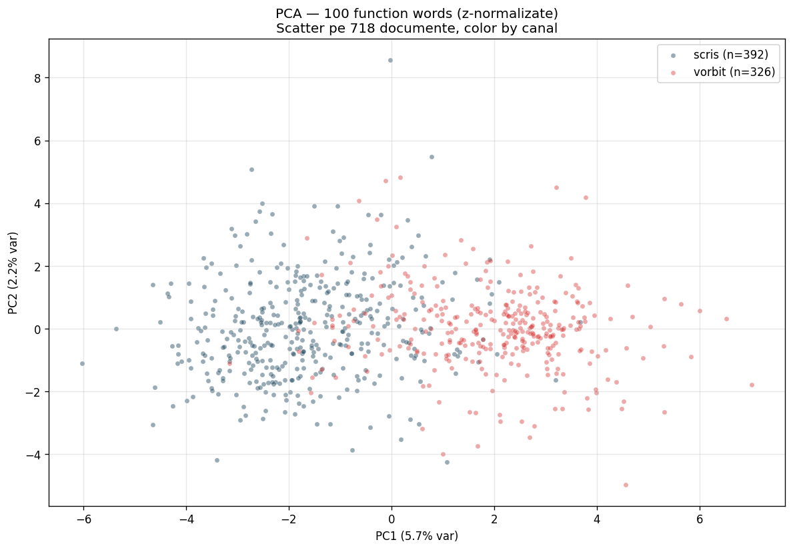

```{python}
#| include: false
import sys, json
from pathlib import Path
ROOT = Path("..").resolve()
sys.path.insert(0, str(ROOT))
import pandas as pd
import plotly.graph_objects as go
import plotly.express as px
```

## Întrebarea de pornire

**Există diferențe cantitative între cum scrie Nicușor Dan pe Facebook și cum vorbește în interviuri/conferințe video?**

Răspunsul scurt: da, mari. Cauza acelor diferențe e o întrebare separată, la care **acest dataset singur nu poate răspunde**.

---

## Diferența #1 — Nuanțare în limbaj (ezitare vs certitudine)

**Ce e**: cât de des folosește cuvinte care **înmoaie** afirmațiile — *"cred că"*, *"mi se pare"*, *"probabil"*, *"ar putea"* — vs cuvinte categorice — *"evident"*, *"sigur"*, *"fără îndoială"*.

Ratio mare = vorbește **prudent, cu nuanțe**. Ratio mic = vorbește **decis, fără ezitare**.

```{python}
#| echo: false
projections = ["Scris (Facebook)", "Vorbit (video)"]
hedge = [0.18, 0.78]

fig = go.Figure()
fig.add_bar(name="Hedge:Cert ratio", x=projections, y=hedge,
            marker_color=["#003049", "#d62828"],
            text=[f"{v:.2f}" for v in hedge],
            textposition="outside",
            textfont=dict(size=20))
fig.update_layout(
    title="Raport ezitare:certitudine (mediu, peste 6 perioade)",
    yaxis_title="Ratio (mai mare = mai delicat)",
    height=400,
    plot_bgcolor="white",
    showlegend=False,
    yaxis_range=[0, 1.0],
    annotations=[
        dict(x=0.5, y=0.95, xref="paper", yref="paper",
             text="<b>Diferență 4-5×</b>",
             showarrow=False, font=dict(size=18, color="#d62828")),
    ],
)
fig.show()
```

Facebook: ratio 0,13-0,23 — categoric, fără ezitare.
Video: ratio 0,51-1,06 — deliberativ, cu nuanțe.

::: {.callout-note}
## Detaliu metodologic
Lexicon RO custom: 35+ markeri de **ezitare/nuanțare** (cred că, probabil, mi se pare, etc.) și 24 markeri de **certitudine** (evident, sigur, categoric). Cuantificate per 1.000 cuvinte. *(În literatură de specialitate, asta se numește "hedging".)*
:::

## Diferența #2 — Pronume personale

```{python}
#| echo: false
data = pd.DataFrame({
    "perioada": ["Q1 2025", "Q2 2025", "Q3 2025", "Q4 2025", "Q1 2026", "Q2 2026"],
    "Scris (FB)": [2.0, 3.3, 2.5, 2.0, 2.2, 0.7],
    "Vorbit (video)": [9.5, 7.3, 5.5, 6.3, 6.7, 5.3],
})
fig = px.line(data, x="perioada", y=["Scris (FB)", "Vorbit (video)"],
              markers=True,
              color_discrete_map={"Scris (FB)": "#003049", "Vorbit (video)": "#d62828"})
fig.update_layout(
    title="Frecvența pronumelor personale (eu, mie, mi se) per 1.000 cuvinte",
    yaxis_title="Mențiuni / 1.000 cuvinte",
    xaxis_title="",
    height=420,
    plot_bgcolor="white",
    legend_title="",
)
fig.show()
```

Pe Facebook ND apare mult mai rar la persoana I (0,7-3,3 pronume personale per 1.000 cuvinte). În video e dominant prezent (5,3-9,5).

## Diferența #3 — Diversitatea lexicală (MTLD)

Cât de variat e vocabularul, normalizat pentru lungime.

```{python}
#| echo: false
fig = go.Figure()
fig.add_trace(go.Scatter(
    x=["Q1 2025", "Q2 2025", "Q3 2025", "Q4 2025", "Q1 2026", "Q2 2026"],
    y=[51, 35, 67, 88, 80, 67],
    mode="lines+markers", name="Scris (FB)",
    line=dict(color="#003049", width=3),
    marker=dict(size=10),
))
fig.add_trace(go.Scatter(
    x=["Q1 2025", "Q2 2025", "Q3 2025", "Q4 2025", "Q1 2026", "Q2 2026"],
    y=[48, 43, 54, 46, 48, 50],
    mode="lines+markers", name="Vorbit (video)",
    line=dict(color="#d62828", width=3, dash="dash"),
    marker=dict(size=10),
))
fig.update_layout(
    title="MTLD — diversitate lexicală (mai mare = vocabular mai bogat)",
    yaxis_title="MTLD score",
    height=420,
    plot_bgcolor="white",
)
fig.show()
```

Vocabularul Facebook **crește dramatic după mandat** (34 → 87 = creștere 2,5×). Vocabularul video **rămâne stabil** (42-54).

## Diferența #4 — Polarizare sentiment

Cum se atitudinează ND față de entitățile pe care le menționează — pozitiv, negativ, mixt, neutru?

```{python}
#| echo: false
fig = go.Figure()
projections = ["Scris (FB)", "Vorbit (video)"]
colors_sent = {"Pozitiv": "#2a9d8f", "Negativ": "#e63946",
               "Mixt": "#f4a261", "N/A + neutru": "#cccccc"}

# Date după retry sentiment (toate buckets-urile clasificate)
scris_pcts = {"Pozitiv": 56, "Negativ": 13, "Mixt": 2, "N/A + neutru": 29}
vorbit_pcts = {"Pozitiv": 43, "Negativ": 12, "Mixt": 38, "N/A + neutru": 7}

for sent, color in colors_sent.items():
    fig.add_bar(
        name=sent,
        x=projections,
        y=[scris_pcts[sent], vorbit_pcts[sent]],
        marker_color=color,
        text=[f"{scris_pcts[sent]}%", f"{vorbit_pcts[sent]}%"],
        textposition="inside",
    )

fig.update_layout(
    barmode="stack",
    title="Distribuție sentiment per entitate (152 buckets clasificate)",
    yaxis_title="% din buckets",
    height=450,
    plot_bgcolor="white",
)
fig.show()
```

**Facebook = 69% polarizat** (pro/contra explicit).
**Video = 55% polarizat**, 38% mixt, 7% neutru.

::: {.callout-warning collapse="true"}
## Limitare metodologică — LLM-ul poate supra-interpreta

Clasificarea sentimentului folosește Gemini 2.5 Flash. Modelul **ocazional citește prea mult** în tonul tensionat din context — etichetează drept "negativ" pasaje în care ND e de fapt mediator sau apără poziția unei entități.

**Exemplu real găsit prin fact-check** (PSD Q2 2026):
- **Gemini a clasificat**: NEGATIV
- **Fact-check web a arătat**: ND a fost MEDIATOR în criza coaliției. PSD a atacat (97.7% vot retragere sprijin Bolojan), ND a încercat să mențină coaliția ("Calm și vom trece prin asta")
- "Nu sunt propunerile PSD-ului" e ND **apărând** procesul de numire, nu critică PSD
- **Override manual aplicat**: NEGATIV → MIXT

**De aceea citatele expandabile sunt importante** — verifică tu însuți, nu te baza orbește pe clasificare.

Pentru transparență: toate override-urile manuale sunt marcate explicit în date (`override_applied: true`, cu rationale completă).
:::

### Exemple — diferențe de ton pe aceeași entitate

```{python}
#| echo: false
#| output: asis
import json
from pathlib import Path

ROOT_DATA = Path("..").resolve()

def load_sent(proj):
    rows = []
    with (ROOT_DATA / "results" / f"09_sentiment_per_entity_{proj}" /
          "sentiment_per_entity_period.jsonl").open() as f:
        for line in f:
            rows.append(json.loads(line))
    return rows

scris_data = load_sent("scris")
vorbit_data = load_sent("vorbit")

def find_row(data, entity, period_contains):
    for r in data:
        if r.get("entity") == entity and period_contains in r.get("period", ""):
            return r
    return None

def quotes_html(r):
    if not r:
        return "<em>(fără date)</em>"
    sent = r.get("sentiment", "?")
    color = {"pozitiv": "#2a9d8f", "negativ": "#e63946",
             "mixt": "#f4a261", "neutru": "#778da9",
             "n/a": "#999"}.get(sent, "#666")
    rat = r.get("rationale", "")
    evs = r.get("supporting_evidence") or r.get("key_phrases") or []
    quotes_block = ""
    for e in evs[:3]:
        quotes_block += f'<blockquote style="margin:0.5rem 0;padding-left:0.75rem;border-left:3px solid #ccc;font-style:italic;font-size:0.9rem;">{str(e)[:300]}</blockquote>'
    return f'''
<details style="margin:0.25rem 0;">
<summary style="cursor:pointer;color:{color};font-weight:600;">{sent.upper()} — click pentru exemple</summary>
<div style="padding:0.5rem 0 0.5rem 1rem;font-size:0.9rem;">
<p style="color:#555;margin-bottom:0.5rem;"><strong>Raționament:</strong> {rat}</p>
<p style="margin:0.3rem 0 0.2rem 0;font-size:0.85rem;color:#666;"><strong>Citate:</strong></p>
{quotes_block}
</div>
</details>'''

# Build table
cases = [
    ("Trump", "TRUMP", "2025Q4-2026Q1", "Q1 2026 (reformă judiciară)"),
    ("PSD", "PSD", "2025Q2 campanie", "Q2 2025 (campanie)"),
    ("Simion", "SIMION", "2025Q2 campanie", "Q2 2025 (campanie)"),
]

html = '<table style="width:100%;border-collapse:collapse;margin:1rem 0;font-size:0.95rem;">'
html += '<thead><tr style="background:#003049;color:white;">'
html += '<th style="padding:10px;text-align:left;width:14%;">Entitate</th>'
html += '<th style="padding:10px;text-align:left;width:22%;">Perioadă</th>'
html += '<th style="padding:10px;text-align:left;width:32%;">Pe Facebook</th>'
html += '<th style="padding:10px;text-align:left;width:32%;">În video</th>'
html += '</tr></thead><tbody>'

for entity_label, entity_canon, period_search, period_label in cases:
    s_row = find_row(scris_data, entity_canon, period_search)
    v_row = find_row(vorbit_data, entity_canon, period_search)
    html += f'<tr style="border-bottom:1px solid #ddd;vertical-align:top;">'
    html += f'<td style="padding:12px;font-weight:600;">{entity_label}</td>'
    html += f'<td style="padding:12px;font-size:0.9rem;">{period_label}</td>'
    html += f'<td style="padding:12px;">{quotes_html(s_row)}</td>'
    html += f'<td style="padding:12px;">{quotes_html(v_row)}</td>'
    html += '</tr>'
html += '</tbody></table>'
print(html)
```

```{python}
#| echo: false
#| output: asis

# Build PSD timeline with expandable details
def find_psd(data, period_contains):
    for r in data:
        if r.get("entity") == "PSD" and period_contains in r.get("period", ""):
            return r
    return None

psd_timeline = [
    ("Q2 2025 (campanie)", "2025Q2 campanie", "campania electorală"),
    ("Q3 2025 (formare guvern)", "2025Q3", "formarea guvernului Bolojan"),
    ("Q4 2025 (stabilizare)", "2025Q4 stabil", "stabilizarea coaliției"),
    ("Q1 2026 (reformă judiciară)", "2025Q4-2026Q1", "reforma judiciară"),
    ("Q2 2026 (criză coaliție)", "2026Q2", "criza din coaliție"),
]

html = '<div style="margin:1.5rem 0;padding:1.5rem;background:#fff8e1;border-left:6px solid #f4a261;border-radius:8px;">'
html += '<h4 style="margin-top:0;">Cazul PSD — story complet în timp</h4>'
html += '<p>PSD apare pe Facebook <strong>doar în campanie</strong> (Q2 2025) — atunci e NEGATIV. După campanie ND <strong>nu mai postează despre PSD pe FB</strong>, chiar dacă devin parteneri de coaliție.</p>'
html += '<p>Pe video însă, PSD apare continuu — evoluție în 5 perioade:</p>'
html += '<table style="width:100%;border-collapse:collapse;margin-top:1rem;">'

for period_label, period_search, context in psd_timeline:
    r = find_psd(vorbit_data, period_search)
    if not r:
        continue
    sent = r.get("sentiment", "?")
    color = {"pozitiv": "#2a9d8f", "negativ": "#e63946",
             "mixt": "#f4a261", "neutru": "#778da9"}.get(sent, "#666")
    rat = r.get("rationale", "")
    evs = r.get("supporting_evidence") or r.get("key_phrases") or []
    quotes = ""
    for e in evs[:3]:
        quotes += f'<blockquote style="margin:0.4rem 0;padding-left:0.75rem;border-left:3px solid #ccc;font-style:italic;font-size:0.88rem;">{str(e)[:300]}</blockquote>'

    html += '<tr style="border-bottom:1px solid #eee;vertical-align:top;">'
    html += f'<td style="padding:8px;width:28%;font-weight:600;font-size:0.9rem;">{period_label}</td>'
    html += f'<td style="padding:8px;">'
    html += f'<details style="margin:0;"><summary style="cursor:pointer;color:{color};font-weight:600;">{sent.upper()} — click pentru exemple</summary>'
    html += f'<div style="padding:0.5rem 0;font-size:0.88rem;">'
    override_notice = ""
    if r.get("override_applied"):
        original = r.get("sentiment_original_gemini", "?")
        override_reason = r.get("override_reason", "")[:500]
        override_notice = (
            f'<div style="background:#fff3cd;border-left:4px solid #f4a261;padding:0.5rem;margin-bottom:0.5rem;font-size:0.85rem;">'
            f'<strong>⚠️ Override manual</strong>: Gemini clasificase <strong>{original.upper()}</strong>, dar fact-check web a arătat altceva. Reformulat ca <strong>{sent.upper()}</strong>.<br>'
            f'<em>Motiv: {override_reason}</em>'
            f'</div>'
        )
    html += override_notice
    html += f'<p style="color:#555;margin-bottom:0.4rem;"><strong>Raționament Gemini:</strong> {rat}</p>'
    html += f'<p style="margin:0.3rem 0 0.2rem 0;font-size:0.8rem;color:#666;"><strong>Citate verbatim:</strong></p>'
    html += quotes
    html += '</div></details>'
    html += '</td></tr>'

html += '</table>'
html += '<p style="margin-top:1rem;font-size:0.9rem;color:#555;">ND alege <strong>selectiv</strong> când să atace pe FB — doar în perioada electorală. Pe video tonul fluctuează cu starea coaliției.</p>'
html += '</div>'
print(html)
```

## Diferența #5 — Topicele descoperite (BERTopic)

Folosind **BERTopic** + multilingual-e5-large + UMAP + HDBSCAN (clustering nesupervizat — modelul nu primește categorii predefinite, le **descoperă** singur din date), am identificat topicele dominante pe fiecare canal.

### Facebook — 7 topice, dar **76% într-unul singur**

```{python}
#| echo: false
#| output: asis

# Read actual BERTopic data
def load_topics_simple(proj):
    import re
    info_path = ROOT_DATA / "results" / f"03_bertopic_{proj}" / "topic_info.md"
    content = info_path.read_text()
    topics = []
    # Parse table
    in_table = False
    for line in content.split("\n"):
        if line.startswith("|") and "Topic" in line and "Count" in line:
            in_table = True
            continue
        if in_table and line.startswith("|--"):
            continue
        if in_table and line.startswith("|"):
            parts = [p.strip() for p in line.split("|")[1:-1]]
            if len(parts) >= 3:
                topics.append({"id": parts[0], "count": int(parts[1]), "name": parts[2]})
        elif in_table:
            in_table = False
    return topics

scris_topics = load_topics_simple("scris")
vorbit_topics = load_topics_simple("vorbit")

# Topic name interpretations (manual + cu cuvinte din data)
scris_labels = {
    "0": ("Mega-topic instituțional", "România, romaniaonesta, româniei, trebuie, nicusorpresedinte, europene, ani, nato, europeană"),
    "1": ("București (proiecte locale)", "bucurești, str, oraș, fonduri, lei, dezvoltarea, public, primăria"),
    "2": ("Legi și instituții", "legea, privind, publice, statului, ocde, clar, cadrul"),
    "3": ("Conferințe presă", "live, presă, declarații, politice, Cotroceni, palatul"),
    "4": ("Disclosure publicitar (artifact)", "sector bucurești, regina elisabeta, cpp, publicitar — etichete impuse de legea publicitară"),
    "5": ("Atac Simion/Georgescu", "george, nicusordan, spune, georgescu, femei"),
    "6": ("Voluntari onestă", "voluntari, onestă, românia onestă, campaniei"),
}

vorbit_labels = {
    "0": ("Politica externă (Ucraina/NATO)", "românia, parte, ucraina, nato, securitate, important"),
    "1": ("Guvern și măsuri", "există, cred, spus, momentul, guvern, măsuri, evident"),
    "2": ("Justiție / CSM", "trebuie, cred, momentul, csm, adică, oameni, public"),
    "3": ("Alegeri și oameni", "cred, trebuie, oamenii, făcut, alegerile"),
    "4": ("Campania Georgescu (anulare)", "momentul, campania, plătit, georgescu, dezinformare"),
    "5": ("Interes național / statul", "românia, național, privește, statului, români"),
    "6": ("Energie / UE / competitivitate", "europa, energie, piață, competitivitate, uniunii"),
    "7": ("Diaspora / Basarabia", "nicușor, românia, împreună, construit, românii, diaspora"),
}

# Build HTML side-by-side
html = '<div style="display:grid;grid-template-columns:1fr 1fr;gap:1.5rem;margin:1rem 0;">'

# SCRIS column
html += '<div style="padding:1rem;background:#003049;color:white;border-radius:8px;">'
html += '<h4 style="margin-top:0;color:white;">Scris (Facebook) — 7 topice</h4>'
html += '<table style="width:100%;color:white;font-size:0.88rem;">'
html += '<thead><tr style="border-bottom:1px solid #fff;"><th style="text-align:left;padding:6px;">Topic</th><th style="text-align:right;padding:6px;">Docs</th></tr></thead><tbody>'
for t in scris_topics:
    if t["id"] == "-1":
        continue
    label, kw = scris_labels.get(t["id"], (t["name"], ""))
    pct = 100 * t["count"] / sum(x["count"] for x in scris_topics)
    highlight = "background:#d62828;color:white;font-weight:700;" if t["count"] >= 100 else ""
    html += f'<tr style="border-bottom:1px solid #555;{highlight}"><td style="padding:8px;">'
    html += f'<strong>{label}</strong><br><span style="font-size:0.8rem;opacity:0.85;font-family:monospace;">{kw}</span>'
    html += f'</td><td style="text-align:right;padding:8px;vertical-align:top;"><strong>{t["count"]}</strong><br><span style="font-size:0.75rem;opacity:0.85;">{pct:.0f}%</span></td></tr>'
html += '</tbody></table></div>'

# VORBIT column
html += '<div style="padding:1rem;background:#d62828;color:white;border-radius:8px;">'
html += '<h4 style="margin-top:0;color:white;">Vorbit (video) — 8 topice</h4>'
html += '<table style="width:100%;color:white;font-size:0.88rem;">'
html += '<thead><tr style="border-bottom:1px solid #fff;"><th style="text-align:left;padding:6px;">Topic</th><th style="text-align:right;padding:6px;">Docs</th></tr></thead><tbody>'
for t in vorbit_topics:
    if t["id"] == "-1":
        continue
    label, kw = vorbit_labels.get(t["id"], (t["name"], ""))
    pct = 100 * t["count"] / sum(x["count"] for x in vorbit_topics)
    html += f'<tr style="border-bottom:1px solid #555;"><td style="padding:8px;">'
    html += f'<strong>{label}</strong><br><span style="font-size:0.8rem;opacity:0.85;font-family:monospace;">{kw}</span>'
    html += f'</td><td style="text-align:right;padding:8px;vertical-align:top;"><strong>{t["count"]}</strong><br><span style="font-size:0.75rem;opacity:0.85;">{pct:.0f}%</span></td></tr>'
html += '</tbody></table></div>'
html += '</div>'
print(html)
```

::: {.callout-note}
## Ce arată asta concret

**Pe Facebook**: **76%** din toate postările (554 din 724) cad într-un **singur mega-topic** dominat de cuvinte instituționale generice — *românia, romaniaonesta, trebuie, nicusorpresedinte, europene, nato*. Adică majoritatea covârșitoare a postărilor sună **aproape la fel**: mesaj branding pro-european. Restul de 6 topice sunt nișe mici (București, Legi, Conferințe, atacuri Simion).

**În video**: discursul se distribuie mai uniform pe **8 topice substanțiale și diferite** — politica externă (Ucraina/NATO), guvern, justiție/CSM, alegeri, energie/UE, diaspora. Niciun topic nu absoarbe mai mult de **22%**.

Plus: video are **25% outliers** (83 docs neclasificabile) — adică un sfert din discursul vorbit e prea liber/spontan pentru a încăpea într-un topic. Pe FB outliers sunt doar 4% — mesaj structurat și format.
:::

---

## Cum arată diferențele cumulat

```{python}
#| echo: false
fig = go.Figure()
metrics = ["Nuanțare/ezitare", "Pronume personale", "Diversitate lexicală", "Polarizare sentiment"]
diff = [4.5, 4.0, 2.5, 2.0]
fig.add_bar(
    x=metrics, y=diff,
    marker_color="#003049",
    text=[f"{d:.1f}×" for d in diff],
    textposition="outside",
    textfont=dict(size=18),
)
fig.update_layout(
    title="Diferențe scris vs vorbit (multiplicator)",
    yaxis_title="Diferență (de câte ori)",
    yaxis_range=[0, 6],
    height=420,
    plot_bgcolor="white",
    showlegend=False,
)
fig.show()
```

Patru metrici independente arată că pe **Facebook** Nicușor Dan apare **mai categoric, mai impersonal, cu vocabular mai diversificat și mai polarizat** față de cum vorbește **live**.

---

## Stylometry formală — Burrows' Delta + PCA + Random Forest

Pentru a testa cantitativ dacă cele 2 registre au amprente stilometrice distincte, am rulat metode stilometrice consacrate pe **718 documente** (≥50 cuvinte).

**Setup**: top 100 *function words* (cuvinte instrumentale: prepoziții, conjuncții, articole, pronume, auxiliare — nu cuvinte de conținut), frecvențe relative, z-normalizate. Apoi:

1. **Burrows' Delta** (distanță stilometrică între centroide)
2. **PCA 2D** (proiecție vizuală)
3. **Random Forest classifier** (cât de ușor distinge un model FB de video?)

| Metoda | Rezultat | Interpretare |
|---|---|---|
| **Burrows' Delta** — distanță centroidă scris↔vorbit | `0.297` | Distanță moderată — cele 2 registre sunt distincte stilometric |
| **Burrows' Delta** — accuracy nearest-centroid | **78.1%** | Vs ~50% random — semnal clar de discriminare |
| **Random Forest** — 5-fold cross-validation accuracy | **92.1% ± 1.7%** | Model simplu distinge FB de video cu acuratețe foarte mare |
| **Random Forest** — held-out 30% test | **94.9%** | 116/118 FB corect + 89/98 video corect (doar 2 FB confundate cu video; 9 video confundate cu FB) |



**Random Forest distinge FB de video cu 92% acuratețe doar din 100 function words** (cuvinte ca *de, și, în, să, fi*, etc.). Asta confirmă **separabilitate stilometrică reală** — nu pot fi confundate.

### Dar ce features discriminează concret?

Top 10 cuvinte care fac diferența:

| Cuvânt | Mai des în | De câte ori | Tip |
|---|---|---|---|
| `niște` | video | **259×** | indefinit colocvial |
| `o` (numeral) | video | 56× | filler scurt |
| `ăă` | video | **41×** | filler ezitare |
| `într` | video | 28× | conector oral |
| `deci` | video | **26×** | conector argumentativ oral |
| `ă` | video | 22× | filler ezitare |
| `crede` | video | 14× | verb modal personal |
| `spune` | video | 6,8× | verb relatare |
| `acesta` | video | 4,9× | deictic ("asta") |
| `că` | video | 3× | conjuncție orală |

| `al` | scris | 2,6× | articol posesiv formal |
| `prin` | scris | 3,7× | prepoziție formală |
| `pentru` | scris | 1,5× | prepoziție |
| `și` | scris | 1,6× | conjuncția "și" |

::: {.callout-important}
## Ce înseamnă rezultatul stilometric

**Bună veste**: cele 2 registre sunt **clar distincte stilometric** (92% accuracy clasificator). Diferența nu e iluzie statistică.

**Veste mai nuanțată**: features care fac diferența sunt **markeri clasici ai vorbirii orale spontane** — fillere (*ăă*, *ă*), deictice (*acesta*), conectori orali (*deci*, *într*), indefinite colocviale (*niște*). Adică **majoritatea separabilității vine din diferența naturală oral-vs-scris formal**, NU dintr-o "altă voce" producând FB.

**Concluzia stilometriei singure**: e **consistent cu diferența naturală oral-vs-scris**, dar e o **diferență foarte clară** (92%) — mai mare decât baseline-ul tipic de 60-80% raportat în literatura stilometrică pentru oral vs scris. **Nu poate distinge** între:
- a) ND adaptează natural stilul
- b) Echipă PR scrie FB cu adăugire în stil formal
- c) Combinație

**Pentru a distinge** ar fi nevoie de:
- **Baseline politic comparativ** (Iohannis FB vs video, Băsescu, Macron) — pattern-ul observat e normal sau anormal de mare?
- **Analiza content-word features** separat de function words
- **Burrows pe sub-tipuri** (ex: doar discursuri prepared vs doar interviuri spontane)
:::

## Ce NU putem spune (deja)

::: {.callout-note}
## Datele nu spun că sunt "doi Nicușor Dan"
Diferențele observate sunt **reale și verificate stilometric**. **Cauza lor e însă neclară**. Există cel puțin patru explicații plauzibile, și nu putem distinge complet între ele:

1. **Diferențe naturale de gen comunicativ**: orice persoană scrie diferit de cum vorbește. Asta e universal — și stilometria confirmă: cele mai mari diferențe sunt fillere și deictice clasice ale vorbirii orale.

2. **Constraint-uri de medium**: postările FB sunt scurte, editabile, polished. Video-ul e real-time, needitabil.

3. **Audiență diferită**: FB pentru susținători/public; video pentru jurnaliști/critici.

4. **Colaborare cu echipă PR**: postările FB pot fi redactate de un team de comunicare. Compatibilă cu datele dar **nu unica explicație**.

**Ce ne lipsește pentru a tranșa**: baseline politic comparativ (Iohannis, etc.). Dacă alți președinți au aceleași pattern de divergență, e pattern instituție.
:::

## Ce putem spune cu încredere

- **Diferențele cantitative sunt mari și consistente** (4 metrici × 6 perioade).
- **Diferența nu e doar de stil**: e și de **conținut emoțional** (polarizare) și de **profunzime tematică** (BERTopic).
- **MTLD-ul Facebook explodează după mandat**, în timp ce video-ul rămâne stabil — asta sugerează **o schimbare a procesului de producție pentru FB după ce ND a câștigat alegerile**.

## Ce înseamnă pentru tine, cititorul

Indiferent de cauză:

- **Postările FB sunt un canal formal**, controlat, cu mesaj polished. Le citești ca pe **anunțuri oficiale**.
- **Interviurile video sunt mai apropiate de gândirea lui ND** — cu pauze, întrebări, revizuiri.
- Dacă vrei să înțelegi cum gândește președintele pe un subiect complex, **uită-te la video, nu la postări**.

---

[← Acasă](index.qmd) · [Citește despre cum a vorbit despre Bolojan →](bolojan.qmd)
